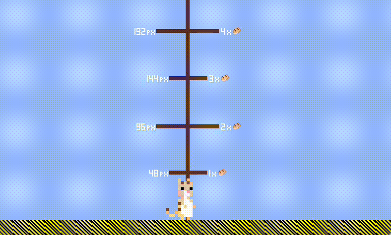

# Jumping Mechanics 

Jumping mechanics best practices for Godot 4. 

### Height of the jump

Mechanic ispired by [Pefeper](https://www.youtube.com/watch?v=IOe1aGY6hXA)'s video. Big thanks to Kyle Pittman and his [talk](https://www.youtube.com/watch?v=hG9SzQxaCm8) for great explanations.

